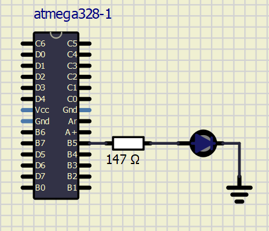

# Lab 1: Samuel Kosik

Link to your `Digital-electronics-2` GitHub repository:

   [GitHub Link](https://github.com/amwellius/Digital-electronics-2)


### Blink example

1. What is the meaning of the following binary operators in C?
   * `|` = OR, sum
   * `&` = AND, product
   * `^` = XOR
   * `~` = NOT, flipping bits
   * `<<` = LEFT Shift
   * `>>` = RIGHT Shift

2. Complete truth table with operators: `|`, `&`, `^`, `~`

| **b** | **a** |**b or a** | **b and a** | **b xor a** | **not b** |
| :-: | :-: | :-: | :-: | :-: | :-: |
| 0 | 0 | 0 | 0 | 1 | 1 |
| 0 | 1 | 1 | 0 | 0 | 1 |
| 1 | 0 | 1 | 0 | 0 | 0 |
| 1 | 1 | 0 | 1 | 1 | 0 |


### Morse code

1. Listing of C code with syntax highlighting which repeats one "dot" and one "comma" on a LED:

```c
#define LED_GREEN   PB5 // AVR pin where green LED is connected         
#define LINE_DELAY  500 // LINE
#define SHORT_DELAY 150 // VERY SHORT DELAY (in ONE letter)
#define DOT_DELAY   250 // DOT
#define LONG_DELAY  800 // NEW Letter
#ifndef F_CPU           // Preprocessor directive allows for conditional
                        // compilation. The #ifndef means "if not defined".
# define F_CPU 16000000 // CPU frequency in Hz required for delay
#endif                  // The #ifndef directive must be closed by #endif

/* Includes ----------------------------------------------------------*/
/* Include another C language file into the current file at the location
 * of the #include statement prior to compiling the source code.
 */
#include <util/delay.h> // Functions for busy-wait delay loops
#include <avr/io.h>     // AVR device-specific IO definitions

/* Function definitions ----------------------------------------------*/
/**********************************************************************
 * Function: Main function where the program execution begins
 * Purpose:  Toggle one LED and use delay library.
 * Returns:  none
 **********************************************************************/
int main(void)      //funkcia
{
    // Set pin as output in Data Direction Register
    // DDRB = DDRB or 0010 0000
    DDRB = DDRB | (1<<LED_GREEN);

    // Set pin LOW in Data Register (LED off)
    // PORTB = PORTB and 1101 1111
    PORTB = PORTB & ~(1<<LED_GREEN);                // << je bit shift 

    // Infinite loop
    while (1)
    {
            
         //WORD "MORSE CODE":
         
         _delay_ms(LONG_DELAY);
         _delay_ms(LONG_DELAY);

        //M --
        PORTB = PORTB ^ (1<<LED_GREEN);     //LED ON
        _delay_ms(LINE_DELAY);
        PORTB = PORTB & ~(1<<LED_GREEN);    //LED OFF
        _delay_ms(SHORT_DELAY);
        PORTB = PORTB ^ (1<<LED_GREEN);     //LED ON
        _delay_ms(LINE_DELAY);
        PORTB = PORTB & ~(1<<LED_GREEN);    //LED OFF
        _delay_ms(LONG_DELAY);

        //O ---
        PORTB = PORTB ^ (1<<LED_GREEN);     //LED ON
        _delay_ms(LINE_DELAY);
        PORTB = PORTB & ~(1<<LED_GREEN);    //LED OFF
        _delay_ms(SHORT_DELAY);
        PORTB = PORTB ^ (1<<LED_GREEN);     //LED ON
        _delay_ms(LINE_DELAY);
        PORTB = PORTB & ~(1<<LED_GREEN);    //LED OFF
        _delay_ms(SHORT_DELAY);
        PORTB = PORTB ^ (1<<LED_GREEN);     //LED ON
        _delay_ms(LINE_DELAY);
        PORTB = PORTB & ~(1<<LED_GREEN);    //LED OFF
        _delay_ms(LONG_DELAY);

        //R .-.
        PORTB = PORTB ^ (1<<LED_GREEN);     //LED ON
        _delay_ms(DOT_DELAY);
        PORTB = PORTB & ~(1<<LED_GREEN);    //LED OFF
        _delay_ms(SHORT_DELAY);
        PORTB = PORTB ^ (1<<LED_GREEN);     //LED ON
        _delay_ms(LINE_DELAY);
        PORTB = PORTB & ~(1<<LED_GREEN);    //LED OFF
        _delay_ms(SHORT_DELAY);
        PORTB = PORTB ^ (1<<LED_GREEN);     //LED ON
        _delay_ms(DOT_DELAY);
        PORTB = PORTB & ~(1<<LED_GREEN);    //LED OFF
        _delay_ms(LONG_DELAY);

        //S ---
        PORTB = PORTB ^ (1<<LED_GREEN);     //LED ON
        _delay_ms(DOT_DELAY);
        PORTB = PORTB & ~(1<<LED_GREEN);    //LED OFF
        _delay_ms(SHORT_DELAY);
        PORTB = PORTB ^ (1<<LED_GREEN);     //LED ON
        _delay_ms(DOT_DELAY);
        PORTB = PORTB & ~(1<<LED_GREEN);    //LED OFF
        _delay_ms(SHORT_DELAY);
        PORTB = PORTB ^ (1<<LED_GREEN);     //LED ON
        _delay_ms(DOT_DELAY);
        PORTB = PORTB & ~(1<<LED_GREEN);    //LED OFF
        _delay_ms(LONG_DELAY);

        //E .
        PORTB = PORTB ^ (1<<LED_GREEN);     //LED ON
        _delay_ms(DOT_DELAY);
        PORTB = PORTB & ~(1<<LED_GREEN);    //LED OFF
        _delay_ms(LONG_DELAY);
        
        //
        //C -.-.
        PORTB = PORTB ^ (1<<LED_GREEN);     //LED ON
        _delay_ms(LINE_DELAY);
        PORTB = PORTB & ~(1<<LED_GREEN);    //LED OFF
        _delay_ms(SHORT_DELAY);
        PORTB = PORTB ^ (1<<LED_GREEN);     //LED ON
        _delay_ms(DOT_DELAY);
        PORTB = PORTB & ~(1<<LED_GREEN);    //LED OFF
        _delay_ms(SHORT_DELAY);
        PORTB = PORTB ^ (1<<LED_GREEN);     //LED ON
        _delay_ms(LINE_DELAY);
        PORTB = PORTB & ~(1<<LED_GREEN);    //LED OFF
        _delay_ms(SHORT_DELAY);
        PORTB = PORTB ^ (1<<LED_GREEN);     //LED ON
        _delay_ms(DOT_DELAY);
        PORTB = PORTB & ~(1<<LED_GREEN);    //LED OFF
        _delay_ms(LONG_DELAY);

        //O ---
        PORTB = PORTB ^ (1<<LED_GREEN);     //LED ON
        _delay_ms(LINE_DELAY);
        PORTB = PORTB & ~(1<<LED_GREEN);    //LED OFF
        _delay_ms(SHORT_DELAY);
        PORTB = PORTB ^ (1<<LED_GREEN);     //LED ON
        _delay_ms(LINE_DELAY);
        PORTB = PORTB & ~(1<<LED_GREEN);    //LED OFF
        _delay_ms(SHORT_DELAY);
        PORTB = PORTB ^ (1<<LED_GREEN);     //LED ON
        _delay_ms(LINE_DELAY);
        PORTB = PORTB & ~(1<<LED_GREEN);    //LED OFF
        _delay_ms(LONG_DELAY);

        //D -..
        PORTB = PORTB ^ (1<<LED_GREEN);     //LED ON
        _delay_ms(LINE_DELAY);
        PORTB = PORTB & ~(1<<LED_GREEN);    //LED OFF
        _delay_ms(SHORT_DELAY);
        PORTB = PORTB ^ (1<<LED_GREEN);     //LED ON
        _delay_ms(DOT_DELAY);
        PORTB = PORTB & ~(1<<LED_GREEN);    //LED OFF
        _delay_ms(SHORT_DELAY);
        PORTB = PORTB ^ (1<<LED_GREEN);     //LED ON
        _delay_ms(DOT_DELAY);
        PORTB = PORTB & ~(1<<LED_GREEN);    //LED OFF
        _delay_ms(LONG_DELAY);

        //E .
        PORTB = PORTB ^ (1<<LED_GREEN);     //LED ON
        _delay_ms(DOT_DELAY);
        PORTB = PORTB & ~(1<<LED_GREEN);    //LED OFF
        _delay_ms(LONG_DELAY);


    }

    // Will never reach this
    return 0;
}

```


2. Scheme of Morse code application, i.e. connection of AVR device, LED, resistor, and supply voltage. The image can be drawn on a computer or by hand. Always name all components and their values!

   
