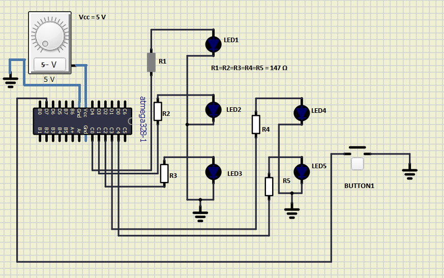

# Lab 3: Samuel Košík

Link to your `Digital-electronics-2` GitHub repository:

   [GitHub Link](https://github.com/amwellius/Digital-electronics-2)


### Data types in C

1. Complete table.

| **Data type** | **Number of bits** | **Range** | **Description** |
| :-: | :-: | :-: | :-- | 
| `uint8_t`  | 8 | 0, 1, ..., 255 | Unsigned 8-bit integer |
| `int8_t`   | 8 | -128 - 127 | 1 byt signed int |
| `uint16_t` | 16 | 0 - 65535 | 2 byt unsigned int |
| `int16_t`  | 16 | -32768 - 32767 | 2 byt signed int |
| `float`    | 32 | -3.4e+38, ..., 3.4e+38 | Single-precision floating-point |
| `void`     | 0 |0  | when type is not declarated |


### GPIO library

1. In your words, describe the difference between the declaration and the definition of the function in C.
   * Function declaration = Znamená prvé predstavenie v kóde, napr `char a;`, `int a(char, float);`, ... Kompilér postupuje po riadoch, preto musia byť premenné, funcie najprv predstavené a až potom definované.
   * Function definition = Znamená to, čo funcia robí, to, čo sa s premennou deje: `x=a+b;`, ... Až počas definície sa alokuje potrebná pamäť.

2. Part of the C code listing with syntax highlighting, which toggles LEDs only if push button is pressed. Otherwise, the value of the LEDs does not change. Use function from your GPIO library. Let the push button is connected to port D:

```c
int main(void)
{
    // Green LED at port B
    GPIO_config_output(&DDRB, LED_GREEN);
    GPIO_write_low(&PORTB, LED_GREEN);

    // Configure the second LED at port C
    GPIO_config_output(&DDRC, LED_RED);
    GPIO_write_low(&PORTC, LED_RED);

    // Configure Push button at port D and enable internal pull-up resistor
    GPIO_config_input_pullup(&DDRD, BUTTON);

    // Infinite loop
    while (1)
    {
        // Pause several milliseconds
        if(GPIO_read(&PIND, BUTTON) == 0)
        {
            _delay_ms(BLINK_DELAY);
            GPIO_toggle(&PORTB, LED_GREEN);
            GPIO_toggle(&PORTC, LED_RED);
            
        }

    }
```


### Traffic light

1. Scheme of traffic light application with one red/yellow/green light for cars and one red/green light for pedestrians. Connect AVR device, LEDs, resistors, one push button (for pedestrians), and supply voltage. The image can be drawn on a computer or by hand. Always name all components and their values!

   
