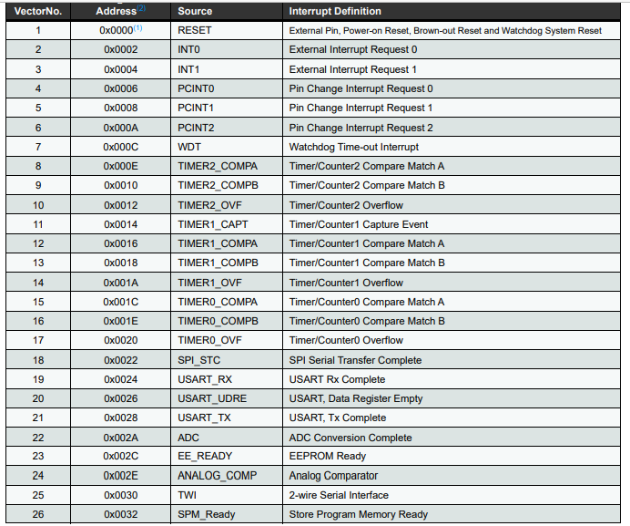
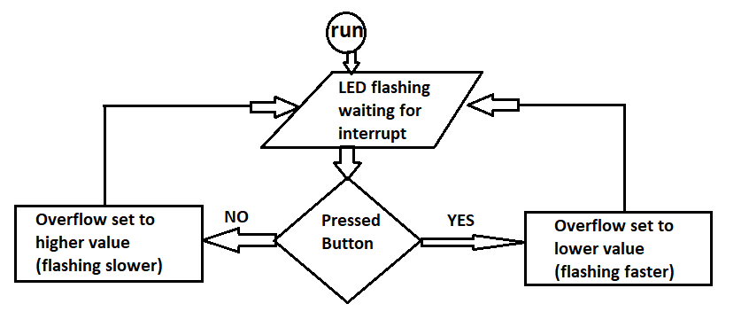
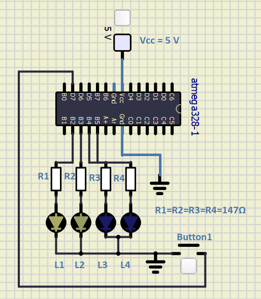

# Lab 4: Samuel Košík

Link to your `Digital-electronics-2` GitHub repository:

   [GitHub Link](https://github.com/amwellius/Digital-electronics-2)


### Overflow times

1. Complete table with overflow times.

| **Module** | **Number of bits** | **1** | **8** | **32** | **64** | **128** | **256** | **1024** |
| :-: | :-: | :-: | :-: | :-: | :-: | :-: | :-: | :-: |
| Timer/Counter0 | 8  | 16u | 128u | 512u | 1024u | 2048u | 4096u | 16.384m |
| Timer/Counter1 | 16 | 4096u | 32.768m | 131.072m | 262.144m | 524.288m | 1048.576m | 4194.304m |
| Timer/Counter2 | 8  | 16u | 128u | 512u | 1024u | 2048u | 4096u | 16.384m |

| **Module** | **Operation** | **I/O register(s)** | **Bit(s)** |
| :-: | :-- | :-: | :-- |
| Timer/Counter0 | Prescaler<br><br>8-bit data value<br>Overflow interrupt enable | TCCR0B<br><br>TCNT0<br>TIMSK0 | CS02 CS01 CS00<br>(000: stopped, 001: 1, 010: 8, 011: 64, 100: 256, 101: 1024)<br>TCNT0[7:0]<br>TOIE0 (timer enable; 1: enable, 0: disable) |
| Timer/Counter1 | Prescaler<br><br>16-bit data value<br>Overflow interrupt enable | TCCR1B<br><br>TCNT1H, TCNT1L<br>TIMSK1 | CS12, CS11, CS10<br>(000: stopped, 001: 1, 010: 8, 011: 64, 100: 256, 101: 1024)<br>TCNT1[15:0]<br>TOIE1 (1: enable, 0: disable) |
| Timer/Counter2 | Prescaler<br><br>8-bit data value<br>Overflow interrupt enable | TCCR2B<br><br>TCNT2<br>TIMSK2 | CS22 CS21 CS20<br>(000: stopped, 001: 1, 010: 8, 011: 64, 100: 256, 101: 1024)<br>TCNT2[7:0]<br>TOIE2 (timer enable; 1: enable, 0: disable) |

   


### Timer library

1. In your words, describe the difference between common C function and interrupt service routine.
   * Function = je súbor príkazov, ktoré sa vykonávajú postupne po zavolaní danej funkcie v hlavnej main funkcii.
   * Interrupt service routine = Vykonáva príkazy, ktoré prikazujú hardwaru zastaviť vykonávanú úlohu a vykonať jednoduché* príkazy, ktoré obsahuje.

2. Part of the header file listing with syntax highlighting, which defines settings for Timer/Counter1, Timer/Counter0 and Timer/Counter2:

```c
* @name  Definitions for 16-bit Timer/Counter1
 * @note  t_OVF = 1/F_CPU * prescaler * 2^n where n = 16, F_CPU = 16 MHz
 */
/** @brief Stop timer, prescaler 000 --> STOP */
#define TIM1_stop()           TCCR1B &= ~((1<<CS12) | (1<<CS11) | (1<<CS10));                   // &= znamena x=x&y
/** @brief Set overflow 4ms, prescaler 001 --> 1 */
#define TIM1_overflow_4ms()   TCCR1B &= ~((1<<CS12) | (1<<CS11)); TCCR1B |= (1<<CS10);
/** @brief Set overflow 33ms, prescaler 010 --> 8 */
#define TIM1_overflow_33ms()  TCCR1B &= ~((1<<CS12) | (1<<CS10)); TCCR1B |= (1<<CS11);
/** @brief Set overflow 262ms, prescaler 011 --> 64 */
#define TIM1_overflow_262ms() TCCR1B &= ~(1<<CS12); TCCR1B |= (1<<CS11) | (1<<CS10);
/** @brief Set overflow 1s, prescaler 100 --> 256 */
#define TIM1_overflow_1s()    TCCR1B &= ~((1<<CS11) | (1<<CS10)); TCCR1B |= (1<<CS12);
/** @brief Set overflow 4s, prescaler // 101 --> 1024 */
#define TIM1_overflow_4s()    TCCR1B &= ~(1<<CS11); TCCR1B |= (1<<CS12) | (1<<CS10);
/** @brief Enable overflow interrupt, 1 --> enable */
#define TIM1_overflow_interrupt_enable()  TIMSK1 |= (1<<TOIE1);
/** @brief Disable overflow interrupt, 0 --> disable */
#define TIM1_overflow_interrupt_disable() TIMSK1 &= ~(1<<TOIE1);

/**
 * @name  Definitions for 8-bit Timer/Counter0
 * @note  t_OVF = 1/F_CPU * prescaler * 2^n where n = 8, F_CPU = 16 MHz
 */
/** @brief Stop timer, prescaler 000 --> STOP */
#define TIM1_stop()           TCCR0B &= ~((1<<CS02) | (1<<CS01) | (1<<CS00));                   
/** @brief Set overflow 4ms, prescaler 001 --> 1 */
#define TIM1_overflow_4ms()   TCCR0B &= ~((1<<CS02) | (1<<CS01)); TCCR0B |= (1<<CS00);
/** @brief Set overflow 33ms, prescaler 010 --> 8 */
#define TIM1_overflow_33ms()  TCCR0B &= ~((1<<CS02) | (1<<CS00)); TCCR0B |= (1<<CS01);
/** @brief Set overflow 262ms, prescaler 011 --> 64 */
#define TIM1_overflow_262ms() TCCR0B &= ~(1<<CS02); TCCR0B |= (1<<CS01) | (1<<CS00);
/** @brief Set overflow 1s, prescaler 100 --> 256 */
#define TIM1_overflow_1s()    TCCR0B &= ~((1<<CS01) | (1<<CS00)); TCCR0B |= (1<<CS02);
/** @brief Set overflow 4s, prescaler // 101 --> 1024 */
#define TIM1_overflow_4s()    TCCR0B &= ~(1<<CS01); TCCR0B |= (1<<CS02) | (1<<CS00);
/** @brief Enable overflow interrupt, 1 --> enable */
#define TIM1_overflow_interrupt_enable()  TIMSK0 |= (1<<TOIE0);             //log 1
/** @brief Disable overflow interrupt, 0 --> disable */
#define TIM1_overflow_interrupt_disable() TIMSK0 &= ~(1<<TOIE0);            //log 0

/**
 * @name  Definitions for 8-bit Timer/Counter2
 * @note  t_OVF = 1/F_CPU * prescaler * 2^n where n = 8, F_CPU = 16 MHz
 */
/** @brief Stop timer, prescaler 000 --> STOP */
#define TIM1_stop()           TCCR2B &= ~((1<<CS22) | (1<<CS21) | (1<<CS20));                   
/** @brief Set overflow 4ms, prescaler 001 --> 1 */
#define TIM1_overflow_4ms()   TCCR2B &= ~((1<<CS22) | (1<<CS21)); TCCR2B |= (1<<CS00);
/** @brief Set overflow 33ms, prescaler 010 --> 8 */
#define TIM1_overflow_33ms()  TCCR2B &= ~((1<<CS22) | (1<<CS20)); TCCR2B |= (1<<CS21);
/** @brief Set overflow 262ms, prescaler 011 --> 64 */
#define TIM1_overflow_262ms() TCCR2B &= ~(1<<CS22); TCCR2B |= (1<<CS21) | (1<<CS20);
/** @brief Set overflow 1s, prescaler 100 --> 256 */
#define TIM1_overflow_1s()    TCCR2B &= ~((1<<CS21) | (1<<CS20)); TCCR2B |= (1<<CS22);
/** @brief Set overflow 4s, prescaler // 101 --> 1024 */
#define TIM1_overflow_4s()    TCCR2B &= ~(1<<CS21); TCCR2B |= (1<<CS22) | (1<<CS20);
/** @brief Enable overflow interrupt, 1 --> enable */
#define TIM1_overflow_interrupt_enable()  TIMSK2 |= (1<<TOIE2);             
/** @brief Disable overflow interrupt, 0 --> disable */
#define TIM1_overflow_interrupt_disable() TIMSK2 &= ~(1<<TOIE2);            

```

3. Flowchart figure for function `main()` and interrupt service routine `ISR(TIMER1_OVF_vect)` of application that ensures the flashing of one LED in the timer interruption. When the button is pressed, the blinking is faster, when the button is released, it is slower. Use only a timer overflow and not a delay library.

   


### Knight Rider

1. Scheme of Knight Rider application with four LEDs and a push button, connected according to Multi-function shield. Connect AVR device, LEDs, resistors, push button, and supply voltage. The image can be drawn on a computer or by hand. Always name all components and their values!
   
   
3. ISR for Knight Rider 
```c
ISR(TIMER1_OVF_vect)        //co vykonava prerusenie 
{
    static uint8_t i = 0;
    static uint8_t q = 0; 
        
    switch(i){
        case(0):
            GPIO_write_high(&PORTB, LED_D1);
            GPIO_write_low(&PORTB, LED_D4);
            GPIO_write_low(&PORTB, LED_D3);
            GPIO_write_low(&PORTB, LED_D2);            
            
            q = 0;
            i++;
            break;
        case(1):
            GPIO_write_low(&PORTB, LED_D1);
            GPIO_write_high(&PORTB, LED_D2);
            GPIO_write_low(&PORTB, LED_D3);
            if(q == 0)
                i++;
            else i--;
            break;
        case(2):
            GPIO_write_low(&PORTB, LED_D2);
            GPIO_write_high(&PORTB, LED_D3);
            GPIO_write_low(&PORTB, LED_D4);
            if(q == 0)
                i++;
            else i--;
            break;             
         case(3):
            GPIO_write_low(&PORTB, LED_D3);
            GPIO_write_high(&PORTB, LED_D4);
            q = 1;
            i--;
            break;
        default:;                 
            
    }
}
```

   
