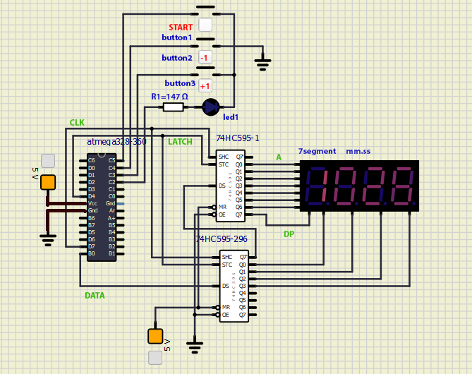

# Lab 5: Samuel Košík

Link to your `Digital-electronics-2` GitHub repository:

   [GitHub Link](https://github.com/amwellius/Digital-electronics-2)


### 7-segment library

1. In your words, describe the difference between Common Cathode and Common Anode 7-segment display.
   * CC SSD
   * CA SSD

2. Code listing with syntax highlighting of two interrupt service routines (`TIMER1_OVF_vect`, `TIMER0_OVF_vect`) from counter application with at least two digits, ie. values from 00 to 59:

```c
ISR(TIMER1_OVF_vect)
{
    //each set time will increase
    maxNumber++;
    if (maxNumber == 60) maxNumber = 0;
}

```c
ISR(TIMER0_OVF_vect)
{
    //This line will only run the first time
    static uint8_t tempPosition = 0;    
    static int pow10[5] = { 1, 10, 100, 1000, 10000 };
    
    uint16_t tempValue;
    tempValue = (maxNumber % pow10[tempPosition+1]) / (pow10[tempPosition]);
    
    //segment.c will get new value
    SEG_update_shift_regs(tempValue, tempPosition);
    
    //display shifting
    tempPosition++;
    if (tempPosition == 4) tempPosition = 0;
}  
```

3. Flowchart figure for function `SEG_clk_2us()` which generates one clock period on `SEG_CLK` pin with a duration of 2&nbsp;us. The image can be drawn on a computer or by hand. Use clear descriptions of the individual steps of the algorithms.

   


### Kitchen alarm

Consider a kitchen alarm with a 7-segment display, one LED and three push buttons: start, +1 minute, -1 minute. Use the +1/-1 minute buttons to increment/decrement the timer value. After pressing the Start button, the countdown starts. The countdown value is shown on the display in the form of mm.ss (minutes.seconds). At the end of the countdown, the LED will start blinking.

1. Scheme of kitchen alarm; do not forget the supply voltage. The image can be drawn on a computer or by hand. Always name all components and their values.

   
