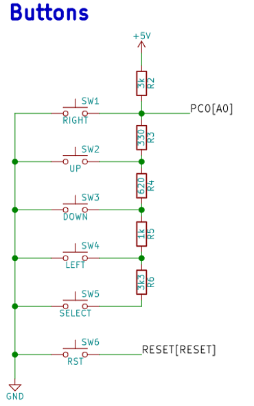
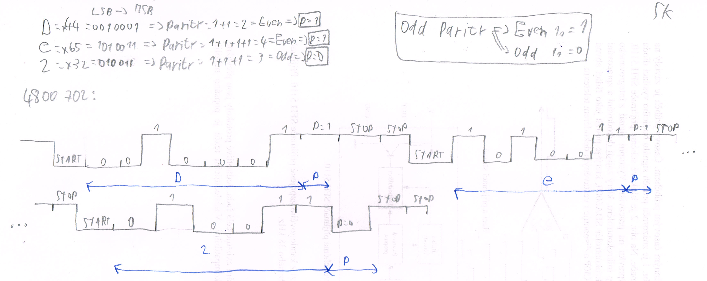
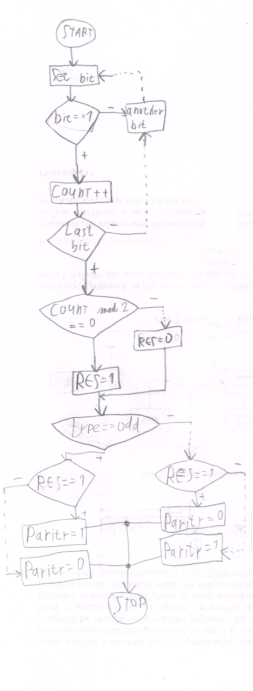
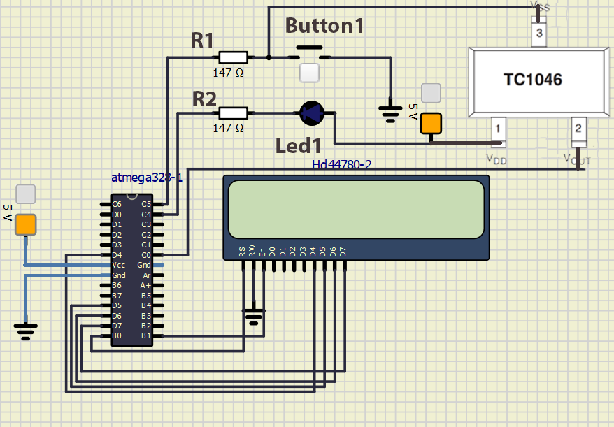

# Lab 7: Samuel Košík

Link to my `Digital-electronics-2` GitHub repository:

(https://github.com/amwellius/Digital-electronics-2)


### Analog-to-Digital Conversion


1. Complete table with voltage divider, calculated, and measured ADC values for all five push buttons.

   | **Push button** | **PC0[A0] voltage** | **ADC value (calculated)** | **ADC value (measured)** |
   | :-: | :-: | :-: | :-: |
   | Right  | 0&nbsp;V | 0   | 0 |
   | Up     | 0.495&nbsp;V | 101 | 99 |
   | Down   |     1.203 V  | 246    | 255 |
   | Left   |     1.970 V  |  403   | 408 |
   | Select |    3.182 V   |    651 | 638 |
   | none   |   5.000 V    |  1023   | 1023 |
   
      | **Operation** | **Register(s)** | **Bit(s)** | **Description** |
   | :-- | :-: | :-: | :-- |
   | Voltage reference    | ADMUX | REFS1:0 | 01: AVcc voltage reference (5V), ... |
   | Input channel        | ADMUX | MUX3:0 | 0000: ADC0, 0001: ADC1, ... |
   | ADC enable           | ADCSRA | ADEN | 1 = ADC ON; 0 = ADC OFF |
   | Start conversion     | ADCSRA | ADSC | 1 = Start conver.; 0 = No Efect! |
   | ADC interrupt enable | ADCSRA | ADIE | 1 = Activated all interupts |
   | ADC clock prescaler  | ADCSRA | ADPS2:0 | 000: Division factor 2, 001: 2, 010: 4, ...|
   | ADC 10-bit result    | ADCL | ADC9:0 | Represents the result according (Vin x 1024)/Vref |

2. Code listing of ACD interrupt service routine for sending data to the LCD/UART and identification of the pressed button. Always use syntax highlighting and meaningful comments:

```c
ISR(ADC_vect)
{
    uint16_t value = 0;
    char lcd_string[4] = "0000";
    
    //ADC je 16 bitova hodnota ktoru on precita naraz
    value = ADC;                  // Copy ADC result to 16-bit variable
    itoa(value, lcd_string, 10);  // Convert decimal value to string 

    // A value displaying
    lcd_gotoxy(8,0);
    lcd_puts("    ");
    lcd_gotoxy(8,0);     
    lcd_puts(lcd_string);
    //uart communication
    uart_puts(lcd_string);
    uart_puts("\r\n");    
    
    // B value
    value = ADC;                  // Copy ADC result to 16-bit variable
    itoa(value, lcd_string, 16);
    
    lcd_gotoxy(13,0);
    //display clearing
    lcd_puts("   ");
    lcd_gotoxy(13,0);    
    lcd_puts(lcd_string);
    //uart communication
    uart_puts(lcd_string);
    uart_puts("\r\n");
        
    // C value
    value = ADC;                  // Copy ADC result to 16-bit variable
    itoa(value, lcd_string, 2);
    lcd_gotoxy(8,1);
    lcd_puts("        ");
    //uart communication
    uart_puts(lcd_string);
    uart_puts("\r\n");
    
    switch(value){
        case 0 ... 90       : lcd_gotoxy(8,1); lcd_puts("right"); uart_puts("right"); uart_puts("\r\n");  break;        //0
        case 91 ... 200     : lcd_gotoxy(8,1); lcd_puts("up"); uart_puts("up"); uart_puts("\r\n");  break;           //99
        case 201 ... 400    : lcd_gotoxy(8,1); lcd_puts("down"); uart_puts("down"); uart_puts("\r\n");  break;         //255
        case 401 ... 600    : lcd_gotoxy(8,1); lcd_puts("left"); uart_puts("left"); uart_puts("\r\n");  break;         //408
        case 601 ... 1000   : lcd_gotoxy(8,1); lcd_puts("select"); uart_puts("select"); uart_puts("\r\n");  break;       //638
        case 1001 ... 1050  : lcd_gotoxy(8,1); lcd_puts("none"); uart_puts("none"); uart_puts("\r\n");  break;         //1023
        default:lcd_puts("       ");
    }      
}
```


### UART communication

   | **Function name** | **Function parameters** | **Description** | **Example** |
   | :-- | :-- | :-- | :-- |
   | `uart_init` | `UART_BAUD_SELECT(9600, F_CPU)` | Initialize UART to 8N1 and set baudrate to 9600&nbsp;Bd | `uart_init(UART_BAUD_SELECT(9600, F_CPU));` |
   | `uart_getc` | void | Get received byte from ringbuffer | `uart_getc()` |
   | `uart_putc` | `data` | Put byte to ringbuffer for transmitting via UART | `uart_putc(data)` |
   | `uart_puts` | `s` | Put string to ringbuffer for transmitting via UART | `uart_puts("Help Me Please! (: ")` |
   
   
1. (Hand-drawn) picture of UART signal when transmitting three character data `De2` in 4800 7O2 mode (7 data bits, odd parity, 2 stop bits, 4800&nbsp;Bd).

   

2. Flowchart figure for function `get_parity(uint8_t data, uint8_t type)` which calculates a parity bit of input 8-bit `data` according to parameter `type`. The image can be drawn on a computer or by hand. Use clear descriptions of the individual steps of the algorithms.

   


### Temperature meter

Consider an application for temperature measurement and display. Use temperature sensor [TC1046](http://ww1.microchip.com/downloads/en/DeviceDoc/21496C.pdf), LCD, one LED and a push button. After pressing the button, the temperature is measured, its value is displayed on the LCD and data is sent to the UART. When the temperature is too high, the LED will start blinking.

1. Scheme of temperature meter. The image can be drawn on a computer or by hand. Always name all components and their values.

   
