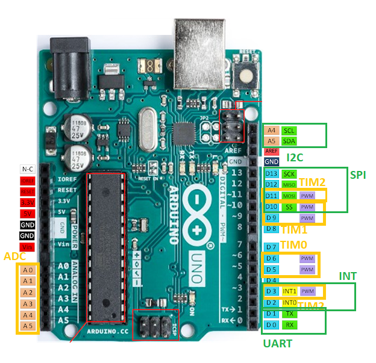
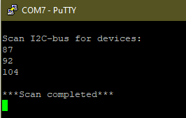

# Lab 8: Samuel Košík

Link to this file `Digital-electronics-2` GitHub repository:

(https://github.com/amwellius/Digital-electronics-2/tree/main/Labs/08-i2c)

## Preparation tasks (done before the lab at home)

1. 

   | **Signal** | **MCU pin** | **Arduino pin(s)** |
   | :-: | :-: | :-: |
   | SDA (data)  | PCINT12/27 | PC4 |
   | SCL (clock) | PCINT13/28 | PC5 |

2. 

   | **Frame type** | **8** | **7** | **6** | **5** | **4** | **3** | **2** | **1** | **0** | **Description**&nbsp;&nbsp;&nbsp;&nbsp;&nbsp;&nbsp;&nbsp;&nbsp;&nbsp;&nbsp;&nbsp;&nbsp;&nbsp;&nbsp;&nbsp;&nbsp;&nbsp;&nbsp;&nbsp;&nbsp;&nbsp;&nbsp;&nbsp;&nbsp;&nbsp;&nbsp;&nbsp;&nbsp;&nbsp;&nbsp;&nbsp;&nbsp;&nbsp;&nbsp;&nbsp;&nbsp;&nbsp;&nbsp;&nbsp;&nbsp;&nbsp;&nbsp;&nbsp;&nbsp; |
   | :-: | :-: | :-: | :-: | :-: | :-: | :-: | :-: | :-: | :-: | :-- |
   | Address | 6 | 5 | 4 | 3 | 2 | 1 | 0 | R/W | ACK/NACK | Contains address of slave device for communication |
   | Data    | 7 | 6 | 5 | 4 | 3 | 2 | 1 | 0 | ACK/NACK | Repeated until all the data bits are transfered properly |

<a name="part1"></a>

### Arduino Uno pinout

1. In the picture of the Arduino Uno board, mark the pins that can be used for the following functions:
   * PWM generators from Timer0, Timer1, Timer2
   * analog channels for ADC
   * UART pins
   * I2C pins
   * SPI pins
   * external interrupt pins INT0, INT1

   

### I2C

   | **Function name** | **Function parameters** | **Description** | **Example** |
   | :-- | :-- | :-- | :-- |
   | `twi_init` | None | Initialize TWI, enable internal pull-up resistors, and set SCL frequency | `twi_init();` |
   | `twi_start` | `uint8_t slave_address` | Starts communication on TWI bus and sends address of TWI slave | `twi_start((addr<<1)+TWI_READ);` |
   | `twi_write` | `uint8_t data` | Sends one data byte to TWI slave device | `twi_start(data);` |
   | `twi_read_ack` | None | Reads one byte from TWI slave device and acknowledges it by ACK | `twi_read_ack();` |
   | `twi_read_nack` | None | Reads one byte from TWI slave device and acknowledges it by NACK | `twi_read_nack();` |
   | `twi_stop` | None | Generates stop condition on TWI bus | `twi_stop();` |

1. Code listing of Timer1 overflow interrupt service routine for scanning I2C devices **without rendering a clear table on the UART** {Ing. Waldecker said so.}

```c
ISR(TIMER1_OVF_vect)
{
    static state_t state = STATE_IDLE;  // Current state of the FSM
    static uint8_t addr = 7;            // I2C slave address
    uint8_t result = 1;                 // ACK result from the bus
    uint8_t data;  
    char uart_string[2] = "00"; // String for converting numbers by itoa()

    // FSM
    switch (state)
    {
    // Increment I2C slave address
    case STATE_IDLE:
        addr++;
      
        
        // If slave address is between 8 and 119 then move to SEND state
        if (addr>8 && addr<119) state = STATE_SEND;
        if (addr >= 120) {
            addr=0;
            uart_puts("\r\n***Scan completed***\r\n");
        }             
        

        break;
    
    // Transmit I2C slave address and get result
    case STATE_SEND:
        // I2C address frame:
        // +------------------------+------------+
        // |      from Master       | from Slave |
        // +------------------------+------------+
        // | 7  6  5  4  3  2  1  0 |     ACK    |
        // |a6 a5 a4 a3 a2 a1 a0 R/W|   result   |
        // +------------------------+------------+
        result = twi_start((addr<<1) + TWI_WRITE);
        
        
     //twi_stop();
        /* Test result from I2C bus. If it is 0 then move to ACK state, 
         * otherwise move to IDLE */
        if (result == 1) {
            state = STATE_IDLE;
        }            
        
        // is active here
        if (result == 0) {
            data = twi_read_ack();
            /*
            itoa(data, uart_string, 10);
            uart_puts("  data: ");
            uart_puts(uart_string);
            uart_puts("\r\n");
            */
            state = STATE_ACK;
        }            

        twi_stop();
        
        break;

    // A module connected to the bus was found
    case STATE_ACK:
        // Send info about active I2C slave to UART and move to IDLE
        itoa(addr, uart_string, 10);
        uart_puts("adress: ");
        uart_puts(uart_string);
        uart_puts("\r\n");
        
        state = STATE_IDLE;

        break;

    // If something unexpected happens then move to IDLE
    default:
        state = STATE_IDLE;
        uart_puts("Something went wrong!");
        break;
    }
}
```
   

2. (Hand-drawn) picture of I2C signals when reading checksum (only 1 byte) from DHT12 sensor. Indicate which specific moments control the data line master and which slave.

   

### Meteo station

Consider an application for temperature and humidity measurement and display. Use combine sensor DHT12, real time clock DS3231, LCD, and one LED. Application display time in hours:minutes:seconds at LCD, measures both temperature and humidity values once per minut, display both values on LCD, and when the temperature is too high, the LED starts blinking.
<br/>
Done by (https://app.diagrams.net/)

1. FSM state diagram picture of meteo station. The image can be drawn on a computer or by hand. Concise name of individual states and describe the transitions between them.

   
